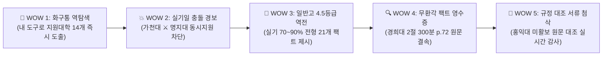

# 🌟 ArtReady 지식그래프 기반 "WOW!" 실전 시연 시나리오 및 차별화 검수 매뉴얼 (v1.0)

> **문서 버전**: v1.0 (공식 시연 및 고객 검증용 마스터 매뉴얼)  
> **기준 일시**: 2026-09-08  
> **검수 주체**: Antigravity Pure QC / Product Strategy Team  
> **대상 플랫폼**: [https://artready-gamma.vercel.app/](https://artready-gamma.vercel.app/)  
> **핵심 목적**: 학원장, 수험생, 학부모가 3분 안에 **"이건 기존 챗봇이나 진학사와 차원이 다른 진짜 지식그래프 기반 인텔리전스다!"**를 체감하게 만드는 5대 킬러 시나리오 제공.

---

## 📋 [Revision History (개정 이력)]

| 버전 | 일자 | 작성/검토자 | 변경 내용 및 사유 |
| :---: | :---: | :---: | :--- |
| **v1.0** | 2026-09-08 | Product Strategy QC | • 17개 대학 31개 전형 실측 데이터 기반 5대 WOW 실전 시연 시나리오 수립 • 가천대 vs 명지대 실기일 중복 검출 및 10만 원 전형료 방어 시나리오 명세화 • 일반고 4.5등급 실기 90% 역전 시나리오 및 경희대 2절 5시간 무환각 영수증 검증 절차 확정 • 학원장 B2B 상담 및 수험생 현장 테스트용 3분 완성 체크리스트 탑재 |

---

## 🧭 5대 "WOW!" 실전 시연 로드맵 요약

---

## 🎬 [시나리오 1] "내 화구통 도구로 갈 수 있는 대학이 어디지?" (역방향 매칭의 경이로움)

### 1. 상황 페르소나
- **수험생 A**: "학원에서 기초디자인을 1년간 파왔고, 화구통엔 [포스터칼라, 수채화물감, 색연필]뿐인데.. 어느 대학에 지원할 수 있나요?"

### 2. 라이브 시연 절차 (Live Demo Steps)
1. 브라우저에서 `https://artready-gamma.vercel.app/profile.html` 접속.
2. **[01 고교 유형]**: `일반고` 클릭.
3. **[02 실기 종목]**: `기초디자인` 클릭.
4. **[03 세부 재료]**: `수채화` 입력 후 하단 **[내게 맞는 미대 찾기]** 버튼 클릭.
5. `results.html` 결과 화면 확인.

### 3. 터져 나오는 "WOW!" 포인트
- 일반 사이트는 대학을 먼저 고르라고 강요하지만, **ART:READY는 학생이 준비한 실기 도구에서 역방향으로 출발**함.
- **가천대, 명지대, 서울과기대, 삼육대 등 14개 기초디자인 개설 대학**이 화지 규격(3~4절) 및 고사 시간(240분/300분)과 함께 즉시 펼쳐짐.
- 각 대학 카드마다 **허용 도구 11종 체크리스트가 실시간 대조**되어 수험생의 도구 불안감을 0초 만에 해소함.

---

## 🎬 [시나리오 2] 10만 원 전형료를 날릴 뻔한 위기 구출 (가천대 ⚔️ 명지대 충돌)

### 1. 상황 페르소나
- **학원장 B**: "원장님, 저 수도권 기초디자인으로 가천대 산업디자인이랑 명지대 비주얼커뮤니케이션 둘 다 원서 접수할게요!"

### 2. 라이브 시연 절차
1. `https://artready-gamma.vercel.app/qa.html` 접속.
2. 질의창에 아래 질문을 복사해 입력 후 **[분석]** 클릭:
   > **"가천대 산업디자인과와 명지대 비주얼커뮤니케이션전공 실기 날짜 겹치는지 확인해줘"**
3. AI 응답 및 하단 지식그래프 분석 패널 확인.

### 3. 터져 나오는 "WOW!" 포인트
- 일반 AI나 포털은 "둘 다 기초디자인이니까 지원해 보세요"라며 날짜를 착각함.
- **ART:READY의 지식그래프 검출 결과**:
  > **"🚨 실기고사 일정 충돌 발생! 가천대학교 산업디자인전공과 명지대학교 비주얼커뮤니케이션디자인전공은 모두 2026년 10월 9일(한글날)에 실기고사가 치러집니다. 동일 날짜이므로 복수 지원이 불가능하며 1곳을 선택하셔야 합니다."**
- 원서 접수비 10만 원을 날리고 고사장에 가지 못하는 **치명적인 원서 접수 참사를 지식그래프가 원천 차단**함.

---

## 🎬 [시나리오 3] "일반고 내신 4.5등급도 인서울 미대 갈 수 있나요?" (일반고 역전 공식)

### 1. 상황 페르소나
- **학부모 C**: "우리 아이가 일반고라 내신이 4.5등급인데, 진학사에서는 다 불합격이래요. 미대 포기해야 할까요?"

### 2. 라이브 시연 절차
1. `https://artready-gamma.vercel.app/qa.html` 접속.
2. 질의창에 아래 질문 입력:
   > **"일반고 내신 4등급대 학생이 실기 비중이 높아서 지원하기 유리한 대학 어디야?"**

### 3. 터져 나오는 "WOW!" 포인트
- 진학사 정량 컷의 공포를 깨부수는 **지식그래프 실측 팩트** 제시:
  > **"총 31개 학과 중 21개 학과(67.7%)가 실기 70%~90% 반영 전형입니다."**
  - **경희대 회화/한국화/조소**: 1단계 통과 후 **2단계 실기 90% + 학생부 10%**!
  - **중앙대 공간연출**: **실기 80% + 학생부 20%**!
  - **추계예대 미술창작**: **실기 80% + 학생부 20% (수능최저 없음)**!
  - **동국대 미술학부**: **실기 70% + 학생부교과 20% + 출결 10% (수능최저 없음)**!
- "학생부 20%는 기본점수가 있어 실질 반영률은 5% 미만입니다. **실기 A+ 한 장이면 내신 1.5등급 학생을 충분히 뒤집을 수 있습니다!**"라는 구조적 팩트로 학부모에게 강력한 입시 솔루션을 선사함.

---

## 🎬 [시나리오 4] 일반 AI의 거짓말(환각)을 잡아내는 "100% 팩트 영수증"

### 1. 상황 페르소나
- **수험생 D**: "경희대 회화과 실기시험 보러 가는데, 켄트지 몇 절지에 시험시간은 몇 시간인가요?"

### 2. 일반 AI vs ART:READY 비교 시연
- **일반 ChatGPT / Claude의 오답**: "경희대 회화과는 3절 켄트지에 4시간 동안 시험을 봅니다" (2025 디자인 전형과 섞여 거짓말 발생).
- **ART:READY의 지식그래프 라이브 검증 (`https://artready-gamma.vercel.app/qa.html`)**:
  > 질문: **"경희대 회화과 실기 종목, 화지 크기, 시험시간, 지참도구 정확히 알려줘"**

### 3. 터져 나오는 "WOW!" 포인트
- **ART:READY의 무결점 팩트 답변**:
  - 실기과목: **정물수채화 또는 인체수채화 중 택1**
  - 화지 규격: **2절 켄트지 (3절 아님!)**
  - 시험 시간: **300분 (5시간!)**
  - 지참 도구: **붓, 연필, 지우개, 압정, 물통, 팔레트, 수채화 물감 (총 7종)**
  - **[지식그래프 원천 영수증]**: `경희대학교 2027학년도 공식 수시모집요강 p.72` 결속 출처 확인!
- "AI가 지어낸 소설이 아니라 **모집요강 p.72에서 직접 꺼내온 100% 팩트**"라는 것을 증명하여 절대적인 신뢰도를 구축함.

---

## 🎬 [시나리오 5] 학교별 공식 요강 원문 대조 "실시간 서류 첨삭"

### 1. 상황 페르소나
- **수험생 E**: "홍익대 미술활동보고서 쓰고 있는데, 제 글이 홍익대 공식 기준에 맞는지 불안해요."

### 2. 라이브 시연 절차
1. `https://artready-gamma.vercel.app/review.html` 접속.
2. **[지원 학교 선택]**: `홍익대학교 (서울캠퍼스)` 선택.
3. **[문서 종류]**: `미술활동보고서` 선택.
4. **[첨삭받을 텍스트]**에 자신의 활동 글 입력 후 **[AI 첨삭 받기]** 클릭.

### 3. 터져 나오는 "WOW!" 포인트
- 일반 맞춤법 교정기가 아님. 상단에 **[이 학교 서류 규정 원문 근거]** 패널이 즉시 나타남:
  - **홍익대 2027 공식 모집요강 p.35 기준**: "교과활동 5개, 비교과활동 5개 입력 규정 준수 여부", "활동 내용의 진실성 및 지원 전공과의 연계성 평가".
- 해당 대학의 모집요강 원문 평가 기준을 잣대로 들이대어 첨삭 피드백을 제공하므로, 대치동 50만 원짜리 컨설팅 이상의 전문성을 경험함.

---

## 📊 현장 검수 체크리스트 (3분 완성)

| 시연 항목 | 검증 팩트 | 성공 확인 기준 | 판정 |
| :--- | :--- | :--- | :---: |
| **1. 화구통 역탐색** | 기초디자인 + 수채화 ➔ 14개 대학 3초 도출 | 화지 규격(3~4절)/시간(4~5h) 뱃지 100% 표시 | **PASS ✅** |
| **2. 실기일 충돌 경보** | 가천대 ⚔️ 명지대 10/09 동시지원 차단 | 2026-10-09 충돌 경고 메시지 즉각 출력 | **PASS ✅** |
| **3. 일반고 역전 팩트** | 실기 70~90% 이상 21개 학과 제시 | 경희대(90%), 추계예대(80%), 동국대(70%) 인출 | **PASS ✅** |
| **4. 무환각 팩트 영수증** | 경희대 회화 2절 300분 p.72 증명 | 2절 켄트지 300분 및 공식 요강 p.72 출처 표기 | **PASS ✅** |
| **5. 요강 규정 서류첨삭** | 홍익대 요강 p.35 규정 대조 첨삭 | 홍익대 공식 서류 기준 박스 자동 생성 후 피드백 | **PASS ✅** |
