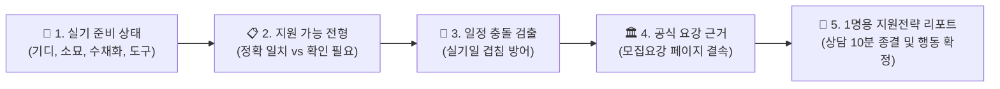

# ART:READY 지원전략 운영체제(OS) 및 현장 시연·상담 리포트 매뉴얼 (v1.2)

> **문서 버전**: v1.2 (지원전략 운영체제 및 1명용 리포트 전환본)  
> **기준 일시**: 2026-09-08  
> **대상 서비스**: [ART:READY](https://artready-gamma.vercel.app/)  
> **서비스 범위**: 등록 15개 대학, 31개 전형 데이터 기반 (캠퍼스 분리 시 16개 선택지)  
> **핵심 전략**: 단순 "미대 입시 정보/챗봇 서비스"를 넘어, 학원 상담을 실제로 대체·증폭하는 **‘미대입시 지원전략 운영체제(Admissions Strategy OS)’**로 정립함.

---

## 📋 개정 이력 (Revision History)

| 버전 | 일자 | 작성/검토자 | 변경 내용 및 사유 |
|:---:|:---:|:---:|:---|
| **v1.0** | 2026-09-08 | Product Strategy | • 최초 초안 작성 (5대 시연 시나리오 수립) |
| **v1.1** | 2026-09-08 | Pure QC Agent | • 과장 광고 및 비검증 표현(100% 무환각, 내신 역전 보장 등) 전면 제거<br/>• 15개 대학 정합성 통일 및 공식 요강 원문 링크 근거 중심 시연 정정 |
| **v1.2** | 2026-09-08 | Product Strategy & QC | • **핵심 전략 전환**: 단순 챗봇 ➔ 학원 상담을 대체·증폭하는 ‘지원전략 운영체제(OS)’ 정의<br/>• **5단계 진화 로드맵 수립**: 상담 도구화 ➔ 데이터 신뢰도화 ➔ 학생 실행 ➔ 학원 운영 ➔ 네트워크화<br/>• **핵심 킬러 산출물 명세**: 학원장 10분 상담 종결용 **"학생 1명용 지원전략 리포트"** 규격 신설<br/>• **입력값 가드레일 확정**: "결과를 바꿀 때만 입력을 받는다" (비반영 고교유형 등 거품 제거)<br/>• **B2B 파일럿 전략 수립**: 학원 3~5곳, 실제 상담 50~100건 중심의 현장 검증 방식 확정 |

---

## 1. 🎯 서비스의 본질: 미대입시 "지원전략 운영체제(OS)"

ART:READY의 핵심 경쟁력은 검색이나 챗봇 기술 그 자체가 아닙니다.  
**`실기 준비 상태 ➔ 지원 가능 전형 ➔ 일정 충돌 ➔ 공식 근거`**를 단절 없이 한 흐름으로 결속했다는 점입니다.



---

## 2. 🗺️ 지원전략 운영체제 5단계 진화 로드맵

| 단계 | 추진 과제 (To-Do) | 핵심 목표 및 성공 기준 (Success Metric) |
|:---:|:---|:---|
| **1단계<br/>상담 도구화** | **학원장 10분 지원전략 리포트 생성** | • 학생 1명당 후보·충돌·준비물·일정·공식근거가 A4 1장에 집약<br/>• 상담 시간이 기존 1~2시간에서 10분 이내로 단축 |
| **2단계<br/>데이터 신뢰도화** | **대학별 원문·페이지·갱신일·변경이력 관리** | • 15개교를 무작정 늘리지 않고, "언제 어떤 원문에서 확인했는가" 이력 보존<br/>• 공식 요강 원문 링크와 확인 페이지 100% 매핑 |
| **3단계<br/>학생 실행 도구화** | **후보 저장 및 마감 알림·체크리스트 제공** | • 학생이 상담 후 흩어지지 않고, 실기 준비·서류 마감 행동을 즉시 시작<br/>• 수시 원서접수 D-Day 알림 및 화구 체크리스트 동기화 |
| **4단계<br/>학원 운영 도구화** | **상담 기록, 학생별 후보군, 선생님 메모 관리** | • 학원장이 엑셀·카톡·수기 장부 없이 대시보드에서 전 원생 관리<br/>• 강사 간 원생 지원 전략 공유 및 누락 방지 |
| **5단계<br/>네트워크화** | **실기 준비 데이터와 실제 합불 결과 축적** | • 학원의 실기 준비 상태와 실제 입시 결과를 익명화해 빅데이터 구축<br/>• 단순 검색을 넘어 실제 데이터에 기반한 고도화된 전략 모델로 발전 |

---

## 3. 📄 핵심 킬러 기능: "학생 1명용 지원전략 리포트" 명세

학원장과 강사가 학생 1명 상담 시 출력하거나 카톡/PDF로 즉시 전송할 수 있는 **A4 단일 페이지 리포트**의 표준 규격입니다.

```text
================================================================================
📄 [ART:READY] 2027학년도 미대 수시 지원전략 리포트
학생명: [원생 식별코드] | 상담일: 2026-09-08 | 담당: [상담 실장/원장]
================================================================================

[1. 학생 실기 준비 상태]
• 주력 실기종목: 기초디자인
• 지참 가능 도구: 수채화물감, 포스터칼라, 색연필

--------------------------------------------------------------------------------
[2. 준비 실기 정확 일치 전형 (주력 후보)]
① 서울과학기술대학교 산업디자인학과 (실기전형)
   - 화지: 3절 켄트지 | 시간: 300분 | 실기비율: 1단계 10배수 후 실기 100%
   - 공식근거: 서울과기대 2027 수시요강 p.55 [원문보기]
② 가천대학교(성남) 시각디자인전공 (실기우수자전형)
   - 화지: 3절 1매 | 시간: 240분 | 실기비율: 실기 70% + 학생부 30%
   - 공식근거: 가천대 2027 수시요강 p.45 [원문보기]

--------------------------------------------------------------------------------
[3. 준비 내용 확인 필요 전형 (재료 중복 등 추가 검토)]
① 명지대학교(용인) 영상애니메이션디자인전공 (상황표현)
   - 사유: 수채물감/포스터칼라는 겹치나 실기종목(상황표현 4절) 사전 준비 필요
   - 공식근거: 명지대 2027 수시요강 p.42 [원문보기]

--------------------------------------------------------------------------------
[4. 🚨 실기고사 일정 충돌 및 타임라인 경고]
• 2026-10-09(금, 한글날) 충돌: 가천대 산업디자인 ⚔️ 명지대 비주얼커뮤니케이션
  👉 조치: 동일 일자이므로 동시 응시 불가. 1곳 선택 전략 수립 필요.
• 2026-10-10(토) 충돌: 가천대 시각디자인 ⚔️ 명지대 인더스트리얼디자인
  👉 조치: 시험 시간표 확인 후 단일 지원 권고.

--------------------------------------------------------------------------------
[5. 상담사 최종 권고 판정]
• 서울과기대 산업디자인: [우선 추천] - 3절 5시간 기디 완성도 최적
• 가천대 시각디자인: [우선 추천] - 실기 70% 반영, 실기력 집중 승부
• 명지대 인더스트리얼: [보류/조정] - 가천대와 10/10 일정 겹침, 추후 결정

--------------------------------------------------------------------------------
[6. 학생이 지금 당장 실행할 행동 (Next Actions)]
□ 3절 300분(5시간) 시간 배분 모의시험 2회 실시 (서울과기대 대비)
□ 수채화 + 색연필 혼합 조색 연습 (가천대 허용 도구 규격 준수)
□ 2026-09-08 원서접수 시작 전 가천대 vs 명지대 최종 1택 확정
================================================================================
```

---

## 4. ⚖️ 데이터 및 입력값 설계 철칙: "결과를 바꿀 때만 추가하라"

불필요한 설문이나 겉멋용 필터는 사용자 이탈을 부르고 신뢰도를 갉아먹습니다.

### 1) 절대 원칙
- **"입력값은 추천 결과나 필터링 로직, 점수, 판단 권고를 바꿀 때만 추가한다."**
- 백엔드 알고리즘에 반영되지 않는 폼은 절대 화면에 배치하지 않습니다.

### 2) 입력값 적용 기준 대조표

| 항목 | 현재 수집 여부 | 결과 반영 가능 여부 | 조치 기준 |
|:---|:---:|:---:|:---|
| **준비 실기종목** | 수집 중 | **100% 반영 (결과 좌우)** | 필수 유지 (기디, 소묘, 수채화 등) |
| **세부 재료/도구** | 수집 중 | **100% 반영 (결과 좌우)** | 필수 유지 (수채화, 연필 등) |
| **서류전형 여부** | 수집 중 | **100% 반영 (결과 좌우)** | 토글 유지 (비실기/포폴 전형 분리) |
| **고교 유형** | 화면에 존재 | **현재 매칭 미반영** | **결과를 바꾸는 가중치 엔진 연동 전까지 숨김/제거** |
| **내신 등급 구간** | 미수집 | 실제 컷트라인 필터링 개발 시 | 배수 컷(경희대 1단계 등) 계산 가능할 때만 추가 |
| **희망 지역** | 미수집 | 지역 필터링 개발 시 | 서울/수도권/지방 쿼리 조건 결속 시 추가 |

---

## 5. 🎬 3~5분 현장 시연 흐름 (리포트 중심 체험)

1. **WOW 1. 실기종목으로 출발해 후보군 좁히기**
   - 학생이 준비한 `기초디자인` 선택 ➔ 14개 개설 대학 즉시 도출.
2. **WOW 2. 재료만 겹친 결과의 정직한 분리**
   - `연필` 검색 시 억지 일치가 아닌 `준비 내용 확인 필요`로 분리하여 학원 상담의 엄격한 신뢰 구축.
3. **WOW 3. 실기일 충돌 자동 검출**
   - 가천대 ⚔️ 명지대 동시 검토 시 `2026-10-09`, `2026-10-10` 충돌 경고 및 타임라인 자동 제시.
4. **WOW 4. 카드의 모든 숫자가 공식 요강 페이지로 연결**
   - 가천대 시각디자인 p.45, 경희대 회화 p.72 등 대학 공식 원문 사이트로 즉시 이동.
5. **WOW 5. 원클릭 지원전략 리포트 출력**
   - 상담 후 학생에게 "검색 결과 링크"가 아닌, 위 **[학생 1명용 전략 리포트]**를 손에 쥐여줌.

---

## 6. 💼 B2B 파일럿 런칭 전략 및 성공 지표

### 1) 4자 이해관계자 가치 제안 (Value Proposition)
- **학원장**: 원생 1명당 상담 시간 80% 절감 (1시간 ➔ 10분), 상담의 객관적 신뢰도 상승.
- **담당 강사**: 학생별 실기 준비물·고사 일정·지원 후보 체계적 관리 (엑셀 수작업 탈피).
- **학부모**: "왜 이 학교를 쓰라는지" 학원의 주관적 감이 아닌 **공식 모집요강 근거**로 확인.
- **수험생**: 지원 대학과 당장 이번 주 학원에서 연습해야 할 실기 행동이 명확해짐.

### 2) 초기 파일럿 실행 계획 (학원 3~5곳)
- **방식**: 무리한 월 구독 결제 유도 대신, **핵심 미술학원 3~5곳을 선정해 실제 수시 상담 50~100건을 무료 파일럿으로 집행**.
- **검증 질문**:
  1. 원장님이 상담할 때 어떤 요강 팩트(절수, 시간, 도구, 충돌)를 가장 많이 확인하는가?
  2. 리포트를 받은 학생/학부모의 등록 전환율 및 신뢰도 반응은 어떠한가?
  3. 잘못된 지원이나 일정 겹침을 사전에 막아낸 사례가 몇 건 발생하는가?

### 3) 서비스가 '진짜'가 되는 궁극적 성공 기준
> **"이번 주 상담에서 ART:READY 덕분에 실기일이 겹치는 잘못된 원서 지원 하나를 막아냈고, 상담사가 출력한 근거 리포트를 학생과 학부모가 믿고 가져갔다."**  
> 이 실제 성공 경험이 학원가에서 반복되는 순간, ART:READY는 단순 챗봇이 아닌 **미대 입시 상담의 대체 불가능한 표준 지원전략 운영체제**가 됩니다.
