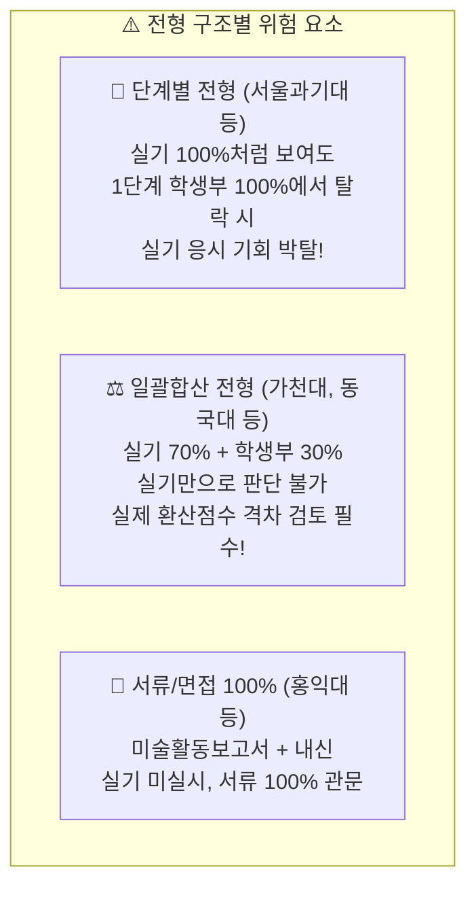

# ART:READY 지원전략 운영체제(OS) 및 실기·내신 결합 분석 매뉴얼 (v1.3)

> **문서 버전**: v1.3 (실기·등급·서류·일정 4각 충돌 분석 및 학생부 관문 엔진 반영본)  
> **기준 일시**: 2026-09-08  
> **대상 서비스**: [ART:READY](https://artready-gamma.vercel.app/)  
> **서비스 범위**: 등록 15개 대학, 31개 전형 데이터 전수 기반 (캠퍼스 분리 시 16개 선택지)  
> **핵심 차별점**: 단순 "실기만 추천하는 서비스"가 아니라, **실기·등급·서류·일정이 서로 충돌하는 지점을 공식 전형 기준으로 정밀하게 찾아주는 대한민국 유일의 ‘미대입시 지원전략 운영체제(OS)’**

---

## 📋 개정 이력 (Revision History)

| 버전 | 일자 | 작성/검토자 | 변경 내용 및 사유 |
|:---:|:---:|:---:|:---|
| **v1.0** | 2026-09-08 | Product Strategy | • 최초 초안 작성 (5대 시연 시나리오 수립) |
| **v1.1** | 2026-09-08 | Pure QC Agent | • 과장 광고 및 비검증 표현(100% 무환각, 내신 역전 보장 등) 전면 제거<br/>• 15개 대학 정합성 통일 및 공식 요강 원문 링크 근거 중심 시연 정정 |
| **v1.2** | 2026-09-08 | Product Strategy & QC | • **지원전략 운영체제(OS)** 정의 및 5단계 진화 로드맵 수립<br/>• 학원장 10분 상담 종결용 **"학생 1명용 지원전략 리포트"** 규격 신설<br/>• B2B 학원 3~5곳 파일럿(50~100건 현장 상담) 전략 수립 |
| **v1.3** | 2026-09-08 | Strategy & Architecture | • **실기·등급 4각 결합 엔진 신설**: "실기 중심이어도 등급은 합격 관문"<br/>• **단계별 전형(Multi-step) 1단계 필터링 경고**: 서울과기대 등 1단계 학생부 100% 관문 규명<br/>• **2단계 점진적 UX 파이프라인**: 1단계(실기 후보 탐색) ➔ 2단계(학생부 반영 분석 개방)<br/>• **상담용 과장 없는 3대 분류**: `합격선/안전권` 단정 금지 ➔ `학생부 추가 검토 필요`, `실기 경쟁력 검토`, `지원 자격 확인`<br/>• **P0~P2 로드맵 및 절대 금지(Non-Negotiable) 조항** 확정 |

---

## 1. 🎯 핵심 철학: "실기 중심이어도 등급은 합격 관문이다"

실기 비중이 70%~90%에 달하더라도, 수시 전형에서 내신/학생부는 **1단계 관문(배수 컷), 최종 합산(30%), 동점자 처리 기준**으로 치명적인 영향을 미칩니다.



### ❌ 절대 금지 원칙 (Non-Negotiables)
1. **과장된 합격 예측 금지**: 등급 수치 하나만 넣고 `합격 확률 85%`, `합격선`, `안전권`을 자동 단정하는 행위 엄격 금지.
2. **독립 입력칸 남발 금지**: 고교 유형처럼 전형 결과에 영향을 주지 않는 거품 입력칸 배제.
3. **위험한 마케팅 배제**: "일반고 5등급도 실기로 무조건 역전" 같은 무책임한 선동 전면 차단.

---

## 2. 🧩 실기·등급 4각 결합 기능 매트릭스

ART:READY는 등급을 단순 텍스트 입력칸으로 받지 않고, **전형별로 학생부가 미치는 실제 물리적 영향력을 계산·제시하는 인텔리전스 엔진**으로 작동합니다.

| 기능 영역 | 시스템이 학생/학원장에게 보여줄 명세 | 판정의 공식 근거 |
|:---|:---|:---|
| **1. 지원 가능 관문** | • `1단계 학생부 통과 여부 확인 필요 (8~10배수)`<br/>• `수능최저학력기준 없음`<br/>• `출결/봉사 감점 반영 여부 확인` | 대학별 공식 모집요강 전형 단계 및 지원 자격 |
| **2. 등급 영향도** | • `1단계: 학생부교과 100% ➔ 2단계: 실기 100%`<br/>• `일괄합산: 실기 70% + 학생부교과 30%`<br/>• `일괄합산: 실기 90% + 학생부교과 10%` | 대학별 전형 요소별 실질 반영비율 |
| **3. 실기와 등급의 관계** | • `실기가 강해도 학생부가 먼저 1차 관문인 전형`<br/>• `실기 비중이 높아 실기력 중심 전략 검토 가치가 있는 전형`<br/>• `비실기 서류 100% 전형 (실기 준비 불필요)` | 지식그래프 다단계 전형 경로 분석 |
| **4. 상담용 전략 상태 분류** | • `학생부 추가 검토 필요` (1단계 컷 위험군)<br/>• `실기 경쟁력 집중 검토` (일괄 실기 70~90%)<br/>• `지원 자격 및 서류 확인` (미활보/최저 기준) | 과장 없는 정직한 전략 상태 코드 |
| **5. 원문 무환각 근거** | • 각 판정 옆에 해당 대학 모집요강 페이지 번호 및 PDF 직결 링크 결속 | 100% 공식 모집요강 원문 |

---

## 3. 🔄 권장 사용자 분석 흐름 (2-Step Progressive Flow)

사용자에게 처음부터 불필요한 성적 입력을 강요하지 않고, **실기 탐색 후 학생부 영향도를 점진적으로 개방**하는 정밀 UX 흐름을 적용합니다.

```
[1단계: 실기 기반 후보군 탐색]
  준비 실기종목(기초디자인 등) + 지참 도구 선택 ➔ 1차 후보군 도출
                           ▼
[2단계: 학생부 반영 분석 개방] (필요 시에만 오픈)
  학생 입력: 전체 평균등급, 주요 교과(국/영/사/미), 결석일수, 수능최저 충족 예상
                           ▼
[3단계: 전형별 맞춤형 실측 영향도 및 경고 카드 출력]
```

### 💡 전형별 실제 카드 출력 예시 (Ground-Truth Output)

#### 1) 서울과학기술대학교 산업디자인학과 (단계별 전형)
> **⚠️ 1단계 학생부교과 100% (8~10배수) ➔ 2단계 실기 100%**  
> • **주의**: 실기 비중(100%)만 보고 지원하면 대단히 위험합니다. 먼저 1단계 학생부 통과 가능성을 학원 상담에서 면밀히 확인해야 합니다.  
> • **공식 원문 확인**: 서울과기대 2027 수시요강 p.55 [원문보기] (반영 교과: 국어, 영어, 사회)

#### 2) 가천대학교 시각디자인전공 (일괄합산 전형)
> **📊 실기 70% + 학생부교과 30% (일괄합산)**  
> • **분석**: 학생부 30%가 최종 점수에 직접 반영됩니다. 실기력만으로 섣부르게 판단하면 안 되며, 전년도 내신 실질 감점 폭을 함께 검토해야 합니다.  
> • **공식 원문 확인**: 가천대 2027 수시요강 p.45 [원문보기] (우수 4개 학기 반영, 출결 기준 확인)

#### 3) 경희대학교 회화전공 (실기 초고비중 전형)
> **🎨 실기 90% + 학생부교과 10% (일괄합산)**  
> • **분석**: 실기 실질 반영비율이 압도적(90%)이므로, 학생부 영향력이 상대적으로 적어 실기 경쟁력으로 정면 승부 검토 가치가 높은 전형입니다.  
> • **공식 원문 확인**: 경희대 2027 수시요강 p.72 [원문보기]

---

## 4. 📄 업데이트된 "학생 1명용 4각 지원전략 리포트" (A4 규격)

실기, 등급, 서류, 일정이 한눈에 들어오는 학원 상담 종결용 통합 리포트 규격입니다.

```text
================================================================================
📄 [ART:READY] 2027학년도 미대 수시 지원전략 리포트 (통합 상담용)
학생명: 김수험 (가명) | 평균내신: 4.2등급 | 주력실기: 기초디자인 (수채화+색연필)
상담일: 2026-09-08 | 담당: [원장/수석상담사]
================================================================================

[1. 실기·학생부 종합 판정 후보군]
--------------------------------------------------------------------------------
① 서울과학기술대학교 산업디자인학과 (실기전형)
   • 전형방식: [단계별] 1단계 학생부 100%(8~10배수) ➔ 2단계 실기 100%
   • 전략분류: [학생부 추가 검토 필요]
   • 핵심진단: 4.2등급 기준 1단계 배수 통과 여부가 최우선 관건. 불통 시 실기 응시 불가!
   • 공식근거: 서울과기대 수시요강 p.55 [원문링크]

② 가천대학교(성남) 시각디자인전공 (실기우수자)
   • 전형방식: [일괄합산] 실기 70% + 학생부교과 30%
   • 전략분류: [실기 경쟁력 검토]
   • 핵심진단: 3절 4시간 기디. 학생부 30% 감점 폭을 실기 A권 점수로 극복 가능한지 타진.
   • 공식근거: 가천대 수시요강 p.45 [원문링크]

③ 명지대학교(용인) 인더스트리얼디자인 (실기우수자)
   • 전형방식: [일괄합산] 실기 70% + 학생부교과 30%
   • 전략분류: [일정 충돌 보류] 🚨 2026-10-10 가천대 시각디자인과 실기일 100% 겹침!
   • 핵심진단: 가천대 vs 명지대 중 1곳 택일 필수.
   • 공식근거: 명지대 수시요강 p.42 [원문링크]

--------------------------------------------------------------------------------
[2. 🚨 4대 충돌 및 자격 체크리스트]
[ ] 2026-10-09(금): 가천대 산디 ⚔️ 명지대 비컴 ➔ 동시 응시 불가 (택1 확정 필요)
[ ] 2026-10-10(토): 가천대 시디 ⚔️ 명지대 인디 ➔ 동시 응시 불가 (택1 확정 필요)
[ ] 서울과기대: 1단계 교과 성적 커트라인 상담실장 배치표 대조 완료 여부
[ ] 수능최저: 대상 전형 모두 수능최저 미적용 (실기·내신 집중 가능)

--------------------------------------------------------------------------------
[3. 상담사 최종 권고 및 이번 주 학생 실행 과제 (Next Actions)]
• 최종 권고: 가천대 시각디자인(실기 집중) 주력 + 과기대(1단계 통과 가능 시 과감 지원)
• 학생 실행 과제:
  1. 3절 240분(4시간) 실전 모의평가 1회 실시 (가천대/명지대 대비)
  2. 3학년 1학기 국어/영어/사회 세부 등급표 학원 제출 (과기대 배수 산출용)
  3. 9월 원서접수 전 10/10 시험 가천대 1택 최종 확정
================================================================================
```

---

## 5. 🚀 개발 및 데이터 로드맵 우선순위 (P0 ~ P2)

| 우선순위 | 영역 | 세부 개발 과제 | 완료 기준 |
|:---:|:---|:---|:---|
| **P0<br/>(필수)** | **데이터 구조화** | • 15개 대학 31개 전형의 **단계별 전형 방식(1단계/2단계 배수 및 반영비율)** 전수 분리<br/>• 학생부 교과/출결/수능최저 반영 여부 메타데이터 구조화 | DB/JSON 필드에 `step_type`, `step1_ratio`, `step2_ratio` 100% 매핑 |
| **P1<br/>(핵심)** | **영향도 엔진** | • 학생 등급 입력 시 전형별 `등급 영향도(주의/검토/적합)` 및 `추가 확인 항목` 자동 출력<br/>• 단계별 전형에 대한 1단계 탈락 경고 배너 프론트 노출 | 프론트 결과 카드에 1단계 관문 경고 100% 표출 |
| **P2<br/>(참고)** | **공식 결과 연동** | • 대학별 '어디가' 및 공식 입학처 발표 전년도 70% 컷/합격자 등급 범위 참고 제공 | 공식 데이터가 있는 전형에 한해 '단순 참고용'으로만 표기 |

---

## 6. 🏆 ART:READY의 진짜 차별점

> **“실기만 추천하는 서비스는 널려 있습니다.”**  
> 그러나 미대 입시 현장에서 학원장과 학부모가 가장 절실하게 필요로 하는 것은,  
> **실기·등급·서류·일정이 서로 충돌하는 지점을 공식 모집요강 기준으로 한 치의 오차 없이 찾아내 오지원을 막아주는 것**입니다.

ART:READY는 허위 합격선이나 헛된 희망을 팔지 않고, **공식 요강에 기반한 냉철한 지원전략을 제공함으로써 학원 상담의 격을 높이는 표준 OS**로 자리매김합니다.
