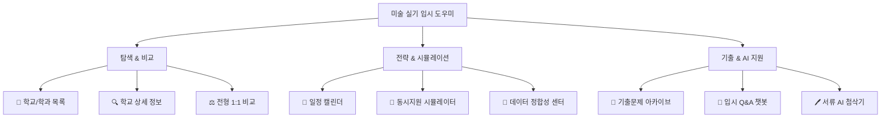

# 🎨 [미술 실기 입시 도우미] 서비스 완벽 활용 가이드 (User Manual)

> **문서 버전**: v1.0  
> **최종 갱신일**: 2026-09-07  
> **대상 사용자**: 미술·무대미술·디자인 수시 수험생, 학부모, 입시 지도 강사  
> **서비스 접속 경로**: DART-Trace 통합 대시보드 최상단 `서비스 전환` ➔ **🎨 미술 실기 입시 도우미** 선택

---

## 🌟 1. 서비스 개요 및 설계 철학

**"미술 실기 입시 도우미"**는 복잡하고 대학마다 제각각인 미술·무대미술·디자인 계열 수시 모집요강을 한눈에 파악하고, 실기 일정 충돌 없이 최적의 **수시 6회 지원 조합**을 설계할 수 있도록 돕는 지식그래프(Knowledge Graph) 기반 입시 분석 플랫폼입니다.

### 🛡️ 핵심 데이터 원칙 (Zero-Mixing)
* **[공식 사실 (Official Facts)] (파란색/녹색)**:
  * 각 대학 입학처가 공식 발표한 **원천 모집요강 PDF**에서 직접 추출한 법적 구속력이 있는 팩트(모집인원, 전형비율, 실기종목, 허용재료, 공식 고사일정 등)만 표시합니다.
  * 모든 공식 사실 카드에는 **원천 PDF 링크(URL)**와 **페이지 번호**가 1:1로 영구 박제되어 검증 가능합니다.
* **[추정치 / 합격 후기 (Estimates)] (노란색/보라색)**:
  * 입시 커뮤니티, 유튜브 합격자 인터뷰, 입시학원 공개 내신 70% 컷 등은 **공식 사실과 100% 분리된 별도 영역**에만 배치됩니다.
  * 절대 공식 사실과 섞어서 왜곡하지 않으며, 출처 채널명과 URL을 함께 제공합니다.

---

## 🚀 2. 서비스 접속 및 기본 환경

1. 웹 브라우저에서 서비스 접속 (`http://localhost:8501` 또는 배포 URL)
2. 화면 최상단 상단바(Header)의 **[서비스 선택]** 토글 확인:
   * `💼 DART-Trace (기업 지배구조)` ➔ **`🎨 미술 실기 입시 도우미`** 클릭
3. 좌측/상단 라디오 버튼을 통해 **9대 핵심 메뉴**로 즉시 전환 가능합니다.

---

## 🧭 3. 9대 핵심 기능별 상세 사용법



---

### 🏫 메뉴 1: 학교/학과 목록
* **기능**: 서비스에 등록된 모든 미술·무대미술 대학 및 개설 학과, 전형명을 그리드 형태로 한눈에 확인합니다.
* **주요 항목**: 대학명, 캠퍼스, 학과명, 전형명, 모집인원, 전형 방식(단계별 vs 일괄합산).
* **활용 팁**: 타깃 학과(예: 무대미술, 공간연출, 회화 등)가 개설된 학교들을 빠르게 스크리닝할 때 사용합니다.

---

### 🔍 메뉴 2: 학교 상세 정보
* **기능**: 특정 대학·전형의 모집요강 전체 팩트와 합격 후기 정보를 심층 열람합니다.
* **화면 구성**:
  1. **상단 요약 메트릭**: 모집정원, 전형비율(예: 실기 70% + 교과 30%), 단계별 선발 배수.
  2. **공식 일정표**: 원서접수 시작~마감, 1단계 합격발표, 실기고사일, 최종 합격자 발표일.
  3. **실기고사 가이드**: 실기 종목명, 고사 시간(분), 용지 규격(3절/4절), **학교 공식 허용 재료 및 금지 재료 목록**.
  4. **원천 출처 확인 배너**: `공식 요강 PDF 원문 열기` 버튼 및 페이지 번호 안내.
  5. **(하단 분리 영역) 합격자 추정치 및 인터뷰**: 과거 합격자 평균 내신 추정 등급, 유튜브 인터뷰 영상 요약.

---

### ⚖️ 메뉴 3: 전형 비교
* **기능**: 지원을 고민 중인 2~3개 대학의 전형을 좌우로 나란히 배치하여 1:1로 비교 대조합니다.
* **비교 요소**:
  * 실기 반영비율 vs 학생부(내신) 반영비율
  * 단계별 전형 유무 (1단계 5배수 컷 등)
  * 수능 최저학력기준 유무
  * 실기 재료 제한사항 (수채화 전용 vs 건식 재료 허용 여부 등)

---

### 📅 메뉴 4: 일정 캘린더
* **기능**: 9월 원서접수부터 10~11월 실기고사, 12월 합격 발표까지의 입시 타임라인을 **월간 그리드 달력**으로 시각화합니다.
* **색상 구분**:
  * 🟦 **파란색 태그**: 원서접수 기간
  * 🟥 **빨간색 태그**: 실기고사일 (고사 시간 중복 주의)
  * 🟩 **초록색 태그**: 합격자 발표일
* **활용 팁**: 날짜 칸에 같은 날 시험을 치르는 복수 대학의 빨간색 태그가 함께 뜨면 **일정 겹침(실기 시간 중복)** 경고 신호입니다.

---

### 🎯 메뉴 5: 동시지원 시뮬레이터 (핵심 추천)
* **기능**: 수험생이 수시 최대 6개(전문대·특수대 제외 무제한) 지원 희망 대학을 가상 선택하여 **고사일 충돌 여부를 1초 만에 자동 진단**합니다.
* **자동 판정 로직**:
  * ⚠️ **동일 일자 중복 경고**: 두 개 이상의 대학 실기고사가 같은 날에 배정된 경우 알림 및 타임테이블 검토 권고.
  * 📊 **전형 조합 분석**: 실기 100% 전형, 단계별 전형, 학생부 병행 전형의 밸런스 점검.
  * 🎯 **전략 제언**: 실기 일정 분산 및 안전/소신 지원 배분 가이드 제공.

---

### 📝 메뉴 6: 기출문제
* **기능**: 최근 3~5개년 실제 출제된 실기고사 지문, 제시어, 출제 주제를 전형별로 모아봅니다.
* **데이터 속성**:
  * 출제 연도 (2025, 2024, 2023 등)
  * 기출 주제 원문 및 제시 지문
  * 당시 경쟁률 및 경쟁률 통계 추이
  * 출처 표기: `[공식]`(대학 입학처 발표) vs `[비공식]`(입시기관 복원) 명확 구분.

---

### 🚦 메뉴 7: 데이터 정합성 (Transparency Center)
* **기능**: 시스템에 적재된 모든 데이터의 원천 출처 URL 및 학년도 라벨 검증 상태를 사용자에게 투명하게 공개합니다.
* **검증 지표**:
  * 대학별 원천 PDF 파일 크기 및 접속 상태 (200 OK)
  * `admission_year`와 원문 표기 일치 여부 (하드 검증 통과 내역)
  * 2027학년도 전형계획 / 2026학년도 요강 반영 단계 현황.

---

### 💬 메뉴 8: 질의응답 (입시 전용 챗봇)
* **기능**: Neo4j 지식그래프와 연동된 LLM 챗봇을 통해 자연어로 입시 요강을 질의합니다.
* **질문 예시**:
  * *"서경대 무대기술전공 실기고사 때 스케일 자 지참 가능한가요?"*
  * *"중앙대 공간연출 1단계 실기 몇 배수 선발이고 반영비율은 어떻게 되나요?"*
  * *"계원예대 수시2차에서 내신 미반영하고 실기 100%로 뽑는 과가 어디인가요?"*
* **특징**: 지식그래프의 검증된 팩트 노드만을 프롬프트 컨텍스트로 제공하므로 환각(Hallucination) 없이 정확한 답변을 출력합니다.

---

### 🖊️ 메뉴 9: 서류 AI 첨삭
* **기능**: 홍익대 미술활동보고서(미활보) 및 대학별 자기소개서 초안을 입력하면 공식 평가 기준에 맞춰 보완점을 진단합니다.
* **진단 기준**:
  * 전공 적합성 및 진로 탐색 과정의 구체성
  * 단순 나열식 기술 지양 및 심화 활동 서술 권고
  * 대학별 인재상 부합 여부 피드백

---

## 💡 4. 수험생 수시 지원 5단계 체크리스트

```text
[Step 1] 🏫 '학교/학과 목록'에서 목표 전공(무대/공간/회화/디자인) 개설교 전체 확인
   ⬇
[Step 2] 🔍 '학교 상세'에서 실기종목 및 학교 제공재료 vs 개인 지참재료 규정 숙지
   ⬇
[Step 3] 📅 '일정 캘린더'에서 10~11월 주말 실기고사 타임라인 전수 파악
   ⬇
[Step 4] 🎯 '동시지원 시뮬레이터'에서 가망 6개교를 담고 일정 충돌 0건 조합 도출
   ⬇
[Step 5] 📝 '기출문제'로 학교별 최근 출제 경향 파악 후 실기 집중 훈련
```

---

## 📌 5. 문의 및 데이터 오류 제보
* 데이터의 이상이나 일정 변동 사항 발견 시, 각 학교 상세 페이지 하단의 `원천 모집요강 PDF`를 우선 확인하시기 바랍니다.
* 본 시스템은 각 대학의 공식 최종 수시 모집요강 공고 시점에 맞춰 지속적으로 최신 팩트를 동기화합니다.
