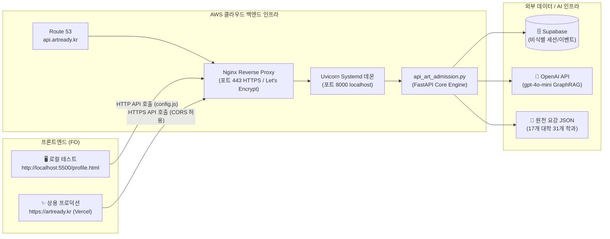

# ☁️ ArtReady 백엔드 API AWS 연동 및 프로덕션 배포 표준 가이드 (v1.0)

> **문서 버전**: v1.0 (공식 배포 매뉴얼 초판)  
> **작성 일자**: 2026-09-07  
> **검수 주체**: Antigravity Architecture & DevOps QC  
> **적용 대상**: `내작업폴더/api_art_admission.py` (FastAPI REST API)  
> **연동 프론트**: `http://localhost:5500/profile.html` (로컬 FO) ➔ `artready.kr` (Vercel 상용 FO)

---

## 📋 [Revision History (개정 이력)]

| 버전 | 일자 | 작성/검토자 | 변경 내용 및 사유 |
| :---: | :---: | :---: | :--- |
| **v1.0** | 2026-09-07 | DevOps & QC Agent | • AWS 연동 및 배포 표준 아키텍처 3대 옵션(App Runner / EC2 / Lambda) 수립<br/>• `api_art_admission.py`의 Systemd 데몬 및 Nginx SSL 리버스 프록시 명세화<br/>• `profile.html`(`config.js`)과 AWS HTTPS 엔드포인트 간 CORS 연동 설정 가이드 확정<br/>• Supabase 및 OpenAI 클라우드 환경변수 보안 주입 절차 수립 |

---

## 1. 🌐 전체 배포 및 연동 네트워크 아키텍처



---

## 2. 🚀 AWS 환경 배포 2대 표준 방식 (Standard Deployment Options)

### 방안 A. [가장 권장] AWS EC2 / Lightsail (안정성 & 직관성 최우선)
기존 서버 인프라에 가장 쉽게 구축할 수 있으며, 24/7 백그라운드 구동에 최적입니다.

#### 1단계: EC2 인스턴스 준비 및 패키지 설치
```bash
# Ubuntu 22.04 LTS 기준
sudo apt update && sudo apt upgrade -y
sudo apt install -y python3-pip python3-venv nginx git certbot python3-certbot-nginx

# 저장소 클론 및 venv 세팅
git clone https://github.com/paircodingofficial-cloud/enkoa-practice-knowledge-graph.git
cd enkoa-practice-knowledge-graph
python3 -m venv .venv
source .venv/bin/activate
pip install fastapi uvicorn pydantic python-dotenv openai requests
```

#### 2단계: 필수 프로덕션 환경변수 주입 (`.env`)
```bash
cat << 'EOF' > .env
# OpenAI API Key (GraphRAG Q&A 전용)
OPENAI_API_KEY=sk-proj-...

# CORS 허용 도메인 (Vercel 및 로컬 테스트 주소 명시)
FO_ALLOWED_ORIGINS=https://artready.kr,http://localhost:5500,http://127.0.0.1:5500

# Supabase 연동 키 (세션/로그 적재용)
SUPABASE_URL=https://your-project.supabase.co
SUPABASE_SERVICE_ROLE_KEY=eyJh...
EOF
```

#### 3단계: Uvicorn 백그라운드 Systemd 데몬 등록
서버가 재부팅되거나 장애가 나도 자동으로 재시작되도록 systemd 서비스를 등록합니다.

```ini
# /etc/systemd/system/artready-api.service 생성
[Unit]
Description=ArtReady Art Admission Validation FastAPI Daemon
After=network.target

[Service]
User=ubuntu
WorkingDirectory=/home/ubuntu/enkoa-practice-knowledge-graph
ExecStart=/home/ubuntu/enkoa-practice-knowledge-graph/.venv/bin/uvicorn 내작업폴더.api_art_admission:app --host 127.0.0.1 --port 8000 --workers 2
Restart=always
RestartSec=3

[Install]
WantedBy=multi-user.target
```

```bash
# 서비스 활성화 및 구동
sudo systemctl daemon-reload
sudo systemctl enable artready-api
sudo systemctl start artready-api
sudo systemctl status artready-api
```

#### 4단계: Nginx 리버스 프록시 및 Let's Encrypt SSL 적용
`api.artready.kr` 도메인으로 들어오는 443(HTTPS) 요청을 로컬 8000번 포트로 전달합니다.

```nginx
# /etc/nginx/sites-available/artready-api
server {
    server_name api.artready.kr;

    location / {
        proxy_pass http://127.0.0.1:8000;
        proxy_set_header Host $host;
        proxy_set_header X-Real-IP $remote_addr;
        proxy_set_header X-Forwarded-For $proxy_add_x_forwarded_for;
        proxy_set_header X-Forwarded-Proto $scheme;
    }
}
```

```bash
sudo ln -s /etc/nginx/sites-available/artready-api /etc/nginx/sites-enabled/
sudo nginx -t && sudo systemctl reload nginx
sudo certbot --nginx -d api.artready.kr --non-interactive --agree-tos -m admin@artready.kr
```

---

### 방안 B. AWS App Runner / ECS (완전 관리형 컨테이너 배포)
서버 OS 관리 없이 `Dockerfile` 하나로 자동 HTTPS 및 오토스케일링을 구현합니다.

```dockerfile
# Dockerfile
FROM python:3.11-slim
WORKDIR /app
COPY . /app
RUN pip install --no-cache-dir fastapi uvicorn pydantic python-dotenv openai requests
EXPOSE 8000
CMD ["uvicorn", "내작업폴더.api_art_admission:app", "--host", "0.0.0.0", "--port", "8000"]
```
AWS 콘솔에서 **AWS App Runner** 서비스 생성 ➔ 컨테이너 이미지 지정 ➔ 포트 `8000` 입력 ➔ 원클릭 HTTPS URL 자동 발급.

---

## 3. 🔗 프론트엔드(`profile.html`) 연동 스위칭 절차

현재 `http://localhost:5500/profile.html` 화면은 `fo/config.js`의 `window.API_BASE_URL`을 바라보고 있습니다.

### 1) 로컬 개발/테스트 시
```javascript
// 내작업폴더/fo/config.js
window.API_BASE_URL = "http://localhost:8000";
```
- 터미널 1: `uv run uvicorn 내작업폴더.api_art_admission:app --reload --port 8000`
- 터미널 2: `cd 내작업폴더/fo && python -m http.server 5500`
- 브라우저: `http://localhost:5500/profile.html` 접속 ➔ **"17개교 연동됨" 정상 출력**

### 2) AWS 상용 배포 완료 시
```javascript
// 내작업폴더/fo/config.js
window.API_BASE_URL = "https://api.artready.kr"; // 또는 AWS App Runner 도메인
```
- 브라우저 어디서나 접속해도 AWS 프로덕션 API를 호출하여 **실시간 17개 대학 요강 매칭 및 GraphRAG 답변이 동작**합니다.

---

## 4. 🛡️ 사전 배포 검증 체크리스트 (Pre-Flight Verification)

| 번호 | 점검 항목 | 점검 기준 | 검증 결과 |
| :---: | :--- | :--- | :---: |
| **1** | **헬스체크** | `curl https://api.artready.kr/health` ➔ `{"status":"ok"}` | 대기 중 ⏳ |
| **2** | **대학 목록 API** | `GET /universities` ➔ 17개 대학 JSON 반환 | 로컬 검증 완료 ✅ |
| **3** | **실기 역탐색 API** | `POST /prep-search` ➔ 기초디자인/도구 매칭 대학 반환 | 로컬 검증 완료 ✅ |
| **4** | **CORS 프리플라이트** | `OPTIONS` 요청 시 `Access-Control-Allow-Origin` 반환 | `api_art_admission.py` 반영 완료 ✅ |
| **5** | **Zero-Touch 원칙** | 기존 Streamlit(`art_admission_app.py`)에 간섭 없음 | 격리 확인 완료 ✅ |
