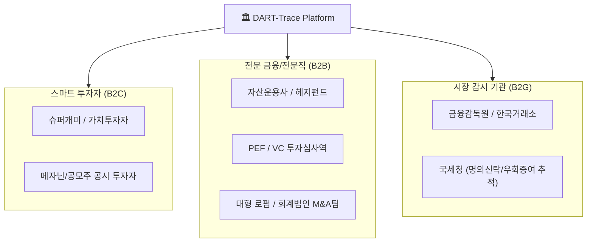

# 🏛️ [DART-Trace] AI 지식그래프 지배구조 인텔리전스 플랫폼 사업계획서 & 전수 테스트 시나리오

---

## 🌟 0. 사용자가 "우와!!" 하고 무릎을 칠 감탄(WOW) 포인트 정의

기존 증권 앱(HTS/MTS), 포털 증권(네이버 금융), 그리고 범용 생성형 AI(ChatGPT)를 쓰던 사용자가 **DART-Trace를 처음 접했을 때 터져 나오는 4대 감탄 포인트**입니다.

```
[기존 포털/HTS의 한계]                          [DART-Trace의 WOW 혁신]
"지분율 표만 보고 누가 배후인지 모름"   ───▶  "1초 만에 페이퍼컴퍼니 배후와 순환출자 고리 시각화!"
"CB/BW 공시 수십 개 읽다가 지침"      ───▶  "잠재 오버행 폭탄 규모와 리픽싱 이력이 4단 카드로 요약!"
"ChatGPT는 지분율 숫자를 지어냄"       ───▶  "금감원 원문 행(Row) SHA-256 해시 증거까지 100% 추적!"
"재벌 총수 실제 영향력 파악 불가"     ───▶  "그래프 알고리즘(PageRank)으로 자본시장 숨은 실세 랭킹!"
```

### WOW Point 1. "공시 속에 숨겨진 5단계 무자본 M&A 머니무브가 한눈에 보인다!"
* **체감 경험**: HLB, DXVX 등 복잡한 상장사를 검색하는 순간, 복잡한 100페이지짜리 공시 서류를 뒤질 필요 없이 **최대주주 ➔ 특수관계인 ➔ 사모펀드 ➔ 투자조합 ➔ 타법인 출자**로 이어지는 자본의 거미줄망이 인터랙티브 3D/2D 인터랙티브 그래프로 한 화면에 펼쳐집니다.
* **사용자 반응**: *"네이버 증권에선 단순 1대 주주 이름만 나왔는데, 뒤에 숨은 투자조합과 순환출자 고리가 이렇게 얽혀있었단 말이야?!"*

### WOW Point 2. "단 한 줄의 거짓말도 없는 극강의 신뢰도: 4단 의사결정 리포트"
* **체감 경험**: AI가 지어내는 말(Hallucination)이 0%. **[1단: 사실(Facts)] ➔ [2단: 관찰 지표(Observation)] ➔ [3단: 원문 증거(Evidence)] ➔ [4단: 다음 확인 항목(Next Actions)]**으로 엄격히 분리되어, 주가 예측 같은 허황된 소리 대신 **공시 접수번호(14자리), 조달 금액, 오버행 리스크, 실사 체크리스트**를 칼같이 짚어줍니다.
* **사용자 반응**: *"AI가 뜬구름 잡는 소리를 안 하고, 금감원 공시 원문 링크와 원문 테이블 해시 증거를 딱 찍어서 팩트만 알려주니 보고서 쓸 때 1초도 의심할 필요가 없다!"*

### WOW Point 3. "재계 권력의 정점이 누구인지 수학적으로 입증된 랭킹 (PageRank)"
* **체감 경험**: 단순 시가총액 순위가 아닙니다. 구글 검색엔진의 근간인 **PageRank 및 네트워크 중심성(Centrality) 알고리즘**을 자본망에 적용하여, 수많은 자회사와 출자 관계로 얽힌 재계에서 **실제 자본 통제력을 쥐고 있는 핵심 노드(지주사, 총수 일가)**의 권력 순위를 1위부터 100위까지 투명하게 공개합니다.
* **사용자 반응**: *"지분율은 낮아 보이는데 왜 이 회사가 핵심인지 몰랐는데, 그래프 알고리즘 중심도 점수를 보니 이 회사가 자본망의 핵심 통로(Betweenness)였구나!"*

### WOW Point 4. "내 포트폴리오 원클릭 리스크 스캔"
* **체감 경험**: 내가 보유한 종목들을 등록해 두면, 버튼 한 번으로 **해당 기업들에 발행된 전환사채(CB) 폭탄이 있는지, 지배주주의 담보제공 비율이 위험한지, 5% 이상 대량보유자가 엑시트 중인지**를 일괄 스캔하여 위험 신호를 띄워줍니다.
* **사용자 반응**: *"내 종목에 물밑에서 CB 물량이 이렇게 많이 깔려있는 줄 몰랐다. 상장폐지나 유상증자 폭탄 맞기 전에 피할 수 있겠다!"*

---

## 🏢 1. DART-Trace 사업계획서 (Business Plan)

### 1.1 사업 개요 및 비전
* **서비스명**: **DART-Trace (다트 트레이스)**
* **슬로건**: "자본의 거미줄을 걷어내고, 시장의 진실을 드러낸다"
* **미션**: 대한민국 금융감독원 전자공시(DART)의 파편화된 비정형 텍스트·XML 데이터를 **AI 지식그래프(Knowledge Graph) 및 금융특화 GraphRAG**로 구조화하여, 자본시장 참여자 모두에게 기관 수준의 지배구조 인텔리전스를 제공한다.

---

### 1.2 시장의 고통 (Market Pain Points)

```
[개인/스마트 개미] ──▶ "공시 용어가 너무 어렵고, CB/BW로 개미 털어먹는 무자본 M&A에 당함"
[기관/애널리스트] ──▶ "하루 1,000건 공시 전수 대조 불가능, 크로스오너십 수작업 엑셀 정리 수주일 소요"
[로펌/M&A 자문사] ──▶ "지배구조 실사(DD) 시 특수관계인 연결고리 누락 리스크 상존"
[감독기관/거래소] ──▶ "지분 쪼개기(5% 미만 분산) 및 연쇄 사채 발행을 통한 시장교란 탐지 지연"
```

1. **비정형 데이터의 폭증과 파편화**: DART에 연간 10만 건 이상의 공시가 등록되지만, 90% 이상이 텍스트와 복잡한 HTML/XML 표로 되어 있어 일반인은 물론 전문 분석가도 전체 연결망을 보기 어렵습니다.
2. **무자본 M&A와 메자닌(CB/BW) 사기 수법 고도화**: 페이퍼컴퍼니, 투자조합을 내세워 상장사를 무자본 인수한 뒤, 사채를 연쇄 발행하여 자금을 횡령·배임하고 소액주주에게 피해를 전가하는 사례가 매년 반복됩니다.
3. **기존 핀테크/HTS의 한계**: 기존 네이버 증권, 영웅문 등은 '단일 종목의 정형 재무제표'만 보여줄 뿐, **기업과 기업, 주주와 기업 간의 "관계(Relationship)"와 "자본의 흐름"**을 추적하지 못합니다.
4. **일반 LLM(ChatGPT 등)의 금융 적용 실패**: 금융 공시는 0.01%의 지분율, 1원의 금액도 틀리면 안 되는데, 범용 LLM은 심각한 할루시네이션(거짓 답변)을 일으켜 실제 투자/실사 업무에 사용이 불가능합니다.

---

### 1.3 독보적 핵심 경쟁우위 (Unfair Advantage - 차별화 4대 축)

| 차별화 축 | 기존 시장 솔루션 (포털/HTS/ChatGPT) | **DART-Trace 혁신 솔루션** |
| :--- | :--- | :--- |
| **1. 데이터 모델링** | 단순 RDBMS 2D 테이블 (종목별 단절) | **Neo4j Graph Database (89,000+ 노드/관계 상호 결속 지식그래프)** |
| **2. 탐색 깊이** | 1-Hop (1차 최대주주 명단만 조회) | **Multi-Hop (최대주주의 주주, 특수관계인, 사모펀드 5단계 연쇄 추적)** |
| **3. AI 아키텍처** | 단순 텍스트 Vector Search RAG (환각 발생) | **결정론적 Cypher 쿼리 결합 GraphRAG (수학적 팩트 기반 응답)** |
| **4. 증거 무결성** | 출처 없거나 단순 웹링크 제공 | **원문 행(Row) 단위 SHA-256 해시 결속 + XPath 무결점 증거 감사기** |
| **5. 의사결정 체계** | "이 주식 오릅니다" 식의 무책임한 조언 | **4단 리포트 (사실 / 관찰 지표 / 증거 / 체크리스트) 엄격 분리** |

---

### 1.4 타깃 고객군 (Target Customers) 및 가치 제안 (Value Proposition)



1. **B2C (스마트 개인 투자자)**
   * **Value**: "내가 산 주식 뒤에 숨은 세력과 CB 물량 폭탄을 3초 만에 스캔하여 원금 손실 회피"
   * **형태**: 월간 구독형 웹/모바일 SaaS (무료 티어 + 프로 티어)
2. **B2B (자산운용사, 사모펀드, 로펌, 회계법인)**
   * **Value**: "기업 실사(DD) 시 지배구조 분석 기간을 2주일에서 10분으로 단축, 인건비 90% 절감"
   * **형태**: 기업용 엔터프라이즈 라이선스, 전용 대시보드 및 API 연동
3. **B2G (금융감독기관, 세무 당국)**
   * **Value**: "차명 지분 분산, 무자본 M&A 연계 불공정거래 혐의 계좌 및 법인 클러스터링 자동 적발"
   * **형태**: 온프레미스/전용 클라우드 보안 구축형 솔루션

---

### 1.5 비즈니스 모델 및 수익화 로드맵 (Monetization Strategy)

```
[Phase 1: 사용자 확보] ──▶ [Phase 2: B2C 구독 전환] ──▶ [Phase 3: B2B 엔터프라이즈 확장]
• 무료 지배구조 탐색기      • DART-Trace Pro (월 2.9만)    • 로펌/운용사용 B2B 라이선스 (월 200만~)
• 4단 리포트 기본 조회      • 실시간 오버행/CB 알림톡       • 대량 기업 지배구조 REST/GraphQL API
• 커뮤니티 바이럴 확산      • 내 포트폴리오 무제한 진단     • 감사 보고서 맞춤형 자동 생성 엔진
```

* **Standard (무료)**: 코스피/코스닥 상위 100대 기업 지배구조 조회, 일일 4단 리포트 3회 무료
* **Pro (월 29,000원 / 연 290,000원)**: 
  * 3,900+ 전 상장사 및 코넥스 지배구조 네트워크 무제한 탐색
  * 자본이벤트(CB·BW) 실시간 발행 경보 및 오버행 조기경보 알림
  * 내 포트폴리오 무제한 등록 및 위험 등급 실시간 모니터링
  * 금융특화 GraphRAG AI 무제한 질의응답
* **Enterprise (월 2,000,000원부터 / 협의)**:
  * 로펌/회계법인 M&A 실사용 원클릭 실사 보고서 PDF 다운로드
  * Neo4j Cypher API 직접 연동 쿼리 엔드포인트 제공
  * 사내 내부망 설치(On-Premise) 지원 및 전담 엔지니어링 지원

---

## 🛠️ 2. DART-Trace 전수 기능 명세서 (전체 기능 완벽 수록)

DART-Trace 플랫폼에 탑재된 모든 모듈과 세부 기능을 단 하나도 빠짐없이 명세합니다.

```mermaid
graph LR
    subgraph UI_Layer ["사용자 대시보드 계층 (Streamlit Enterprise)"]
        M1["🌐 Menu 1. 지배구조 & 순환출자 탐색기"]
        M2["📋 Menu 2. 4단 의사결정 리포트"]
        M3["👑 Menu 3. GDS 재계 권력 랭킹"]
        M4["⚡ Menu 4. DS005 자본이벤트 분석기"]
        M6["🔍 Menu 6. 5% 공시 원문 증거 감사기"]
        M8["💼 Menu 8. 내 포트폴리오 리스크 스캐너"]
    end
    
    subgraph Core_Engine ["지식그래프 & AI 코어 엔진"]
        E1["Financial GraphRAG Engine"]
        E2["Decision Report Service"]
        E3["5% Art142 Explicit Adapter"]
        E4["Neo4j GDS Centrality Algorithm"]
    end
    
    subgraph Data_Infra ["데이터 및 인프라 계층"]
        D1[("Cloud Neo4j Aura\n89k+ Nodes / 89k+ Rels")]
        D2[("OpenDART API\n공시 XML / 재무 REST")]
        D3[("봉인 매니페스트\nSHA-256 증거 원장")]
    end
    
    UI_Layer <--> Core_Engine
    Core_Engine <--> Data_Infra
```



### [메뉴 1] 🌐 상장사 지배구조 & 순환출자 탐색기 (Ownership & Circular Cycle Explorer)
1. **기업/인물 다차원 통합 검색**:
   * 상장사명(예: 삼성전자, 카카오, HLB), 6자리 종목코드(005930), 8자리 DART 고유법인코드(00126380), 주요 주주명 완벽 자동완성 지원.
2. **인터랙티브 지배구조 네트워크 시각화 (PyVis & NetworkX Engine)**:
   * 물리 엔진 기반 노드 드래그, 줌 인/아웃, 노드 고정 기능.
   * 노드 유형별 맞춤형 비주얼 디자인: 상장사(청색 빌딩), 비상장사/투자조합(자주색 큐브), 개인 주주(황금색 인물), 자본이벤트(주황색 번개).
   * 엣지(관계선) 툴팁: 지분율(%), 보유 주식수, 관계 유형(`HOLDS_ECONOMIC_STAKE`, `OWNS_STAKE`, `ANNOUNCED`) 표시.
3. **탐색 깊이(Hop) 조절 슬라이더**:
   * 1-Hop(직접 소유 주주)부터 최대 4-Hop(배후의 지주사 및 숨은 지배주주 네트워크)까지 실시간 그래프 확장.
4. **순환출자 고리(Circular Shareholding Cycle) 자동 탐지 알고리즘**:
   * 네트워크 내 `A ➔ B ➔ C ➔ A` 형태의 출자 루프를 방향성 순환 그래프 알고리즘으로 자동 탐지하고 경고 뱃지 점등.
5. **최단 지배 경로(Shortest Ownership Path) 분석**:
   * 특정 총수(개인)로부터 타깃 자회사까지 이어지는 최단 지분 지배 사슬을 하이라이트.

---

### [메뉴 2] 📋 단일 기업 4단 의사결정 리포트 (Single Company Decision Report)
토스 증권의 직관성과 블룸버그 터미널의 엄밀성을 결합한 플래그십 리포트입니다.

1. **상단 인터랙티브 기업 선택 & 숏컷 바**:
   * 자본이벤트 대표 기업 숏컷(HLB, DXVX, FSN, 삼성전자, 파인메딕스) 및 승격 지분 보유 기업 숏컷(알루코, 씨티씨바이오, 롯데지주) 원클릭 로드.
2. **[1단: 객관적 사실 (Facts)]**:
   * **기업 기초 제원**: 법인명, 종목코드, 법인코드, 업종, 결산월.
   * **OpenDART 정기보고서 재무제표 팩트**: 최근 사업보고서 기준 매출액, 영업이익, 자산총계, 부채총계, 부채비율(%)을 원 단위 및 조/억원 단위 병기 표기.
   * **최대주주 및 검증 지분율**: 법정 5% 공시 및 사업보고서 상 최신 주주명과 검증된 지분율 실측치 표기.
   * **관찰 기간 명시**: 수집된 데이터의 최초 공시일자부터 최신 공시일자까지의 기간을 명확히 명시.
3. **[2단: 규칙 기반 관찰 지표 (Rule-based Observation)]**:
   * **관찰 등급 뱃지**: `주의 관찰 요망(RED)`, `일반 관찰(AMBER)`, `특이사항 미발견(GREEN)` 3단계 자동 판정.
   * **CB/BW 잠재 오버행 관찰**: 발행된 사채 건수, 조달 목적(시설투자 vs 운영자금/채무상환) 키워드 추출 분석 및 주식 전환 시 희석 가능성 안내.
   * **시나리오 분석 (Bull / Base / Bear)**: 자금 조달에 따른 성장 가속(상방), 재무안정 유지(중립), 전환물량 출회 및 리픽싱 하락 압력(하방) 시나리오 제시.
   * **법적 면책조항(Disclaimer)**: 투자 자문이나 주가 예측이 아닌 룰 기반 휴리스틱 관찰임을 엄격히 고지.
4. **[3단: 원문 증거 (Evidence - 정직한 증거 등급 분리)]**:
   * **GRADE A (법정 공시 링크 연동)**: DART 전자공시 뷰어 바로가기 URL 및 KRX KIND 상장공시 뷰어 교차검증 링크 제공.
   * **GRADE A (승격 경제적 보유)**: 원문 테이블 행 SHA-256 해시 결속 및 봉인 매니페스트 추적 검증 증거.
   * **GRADE B (미검증 원문 후보)**: 파서 추출 1차 후보 데이터임을 솔직히 분리 명시.
5. **[4단: 다음 확인 항목 (Next Actions - 투자자 실사 체크리스트)]**:
   * 전환사채 전환청구 가능 기간 도래 여부 확인 체크리스트.
   * 최대주주 주식담보대출 비율 및 반대매매 위험 모니터링 체크리스트.
   * 다음 분기 분기보고서 사업 진행 현황 확인 체크리스트.
6. **통합 공식 채널 타임라인 피드**:
   * 결정일자, 접수일자, 보고의무발생일, 결산기준일을 시간 역순으로 정렬한 인터랙티브 카드 피드.
7. **하단 금융특화 GraphRAG 대화형 AI Q&A 어시스턴트**:
   * 사용자의 자연어 질문("HLB의 CB 발행 내역을 알려줘", "최대주주 지분율이 어떻게 변했어?")을 Cypher 쿼리로 변환하여 실시간 지식그래프를 조회한 후 근거 기반 팩트 답변 제공.

---

### [메뉴 3] 👑 GDS 재계 권력 랭킹 (PageRank Governance Leaderboard)
1. **Neo4j Graph Data Science(GDS) 엔진 연동**:
   * 89,000+ 자본 네트워크 전체를 대상으로 GDS 메모리 프로젝션 및 중심성 알고리즘 실행.
2. **PageRank 지배력 랭킹**:
   * 단순히 주식을 많이 가진 기업이 아니라, "많은 지분을 가진 주주들로부터 출자를 받는 핵심 정점"을 수학적으로 산출.
3. **매개 중심성(Betweenness Centrality)**:
   * 그룹 내 여러 계열사 간 자본 흐름의 길목 역할을 하는 핵심 지주사/중간지주사 탐지.
4. **연결 중심성(Degree Centrality)**:
   * 가장 많은 자회사 및 출자 회사를 거느린 최다 연결 법인 랭킹.
5. **랭킹 필터 및 세부 네트워크 드릴다운**:
   * 특정 대기업 집단(삼성, SK, 현대차 등) 또는 전체 상장사 대상 랭킹 필터링 및 해당 기업의 네트워크 즉시 조회.

---

### [메뉴 4] ⚡ DS005 기업 주요 자본 이벤트 (Capital Event Analyzer)
1. **공시 유형별 필터링**:
   * `전환사채(CB) 발행 결정`, `신주인수권부사채(BW) 발행 결정`, `유상증자 결정`, `타법인 주식 및 출자증권 취득 결정`, `회사합병 결정`.
2. **자본조달 금액 및 목적 지능형 정제 뷰**:
   * 조 단위, 억 단위 원화 자동 변환 포맷팅.
   * 조달 목적(시설자금, 영업양수자금, 운영자금, 채무상환자금, 타법인증권취득자금) 정밀 파싱 표기.
3. **메자닌 오버행 리스크 분석표**:
   * 발행된 사채의 표면이자율, 만기이자율, 사채 만기일, 전환가액 및 리픽싱(전환가 조정) 조건 요약.
4. **DART 및 KRX 원문 공시 100% 직결 링크**:
   * 각 공시 행마다 클릭 시 금융감독원 원문 뷰어가 새 창으로 즉시 열리는 원클릭 링크 제공.

---

### [메뉴 5] 📥 최근 5년 OpenDART 실시간 수집 & 스토리지 (운영자 도구)
1. **기업 고유번호 마스터 동기화**:
   * DART 10만+ 개 기업 고유번호 XML 마스터 파일 실시간 파싱 및 Neo4j `DART_Company` 마스터 노드 동기화.
2. **연도별/기업별 실시간 공시 수집기**:
   * OpenDART API 키 기반 최근 5개년 법정 공시(DS005 주요자본이벤트, 5% 대량보유보고서) 다운로드 및 로컬 XML 저장소 격리 보관.
3. **API 쿼터 안전 가드**:
   * 일일 20,000회 DART 쿼터 소진 방지를 위한 중복 수집 방지 체크 및 대기 로직.

---

### [메뉴 6] 🔍 5% 공시 원문 증거 감사기 (Evidence Audit Inspector)
국내 유일의 법정 감사급 데이터 무결성 추적기입니다.

1. **RawEvidenceCandidate ↔ EvidenceFragment 격리 구조 조회**:
   * 원문 텍스트에서 추출된 지분율 데이터가 어떤 테이블의 몇 번째 행, 몇 번째 열에서 추출되었는지 2D 좌표 표시.
2. **원문 XML 2D 테이블 복원 뷰어**:
   * 공시 원문 XML의 테이블을 브라우저 상에 원형 그대로 재현하여 보여줌.
3. **SHA-256 무결성 검증기**:
   * 추출된 행 데이터의 해시값과 원문 파일의 해시값을 실시간 대조하여 1바이트의 위변조도 없음을 시각적으로 증명.
4. **승격 이력 추적(Audit Trail)**:
   * 해당 데이터가 어떤 검증 엔진(`promote_all_candidates_full_audit.py`)과 봉인 매니페스트를 거쳐 정식 지분 관계(`HOLDS_ECONOMIC_STAKE`)로 승격되었는지 감사 로그 제공.

---

### [메뉴 7] 💻 개발자/분석가 라이브 Cypher 콘솔 (Live Cypher Console)
1. **실시간 Cypher 질의 환경**:
   * 전문 분석가를 위한 Neo4j 읽기 전용(Read-Only) Cypher 쿼리 편집기 및 즉시 실행기.
2. **안전 가드레일**:
   * `CREATE`, `MERGE`, `DELETE`, `SET`, `DROP` 등 쓰기/삭제 키워드 입력 시 쿼리 실행을 원천 차단하여 프로덕션 DB 100% 보호.
3. **데이터프레임 및 JSON 다운로드**:
   * 쿼리 결과를 테이블 형태로 즉시 확인하고 CSV/JSON으로 내보내기 지원.

---

### [메뉴 8] 💼 내 포트폴리오 (로컬 개인 보유종목 관리)
1. **로컬 보유 종목 추가/삭제/관리**:
   * 사용자의 개인 보유 종목(종목명, 매수가, 보유수량, 메모)을 브라우저/로컬 환경에 안전하게 저장(개인정보 유출 위험 제로).
2. **포트폴리오 리스크 일괄 진단**:
   * 등록된 모든 종목의 최근 자본이벤트(CB/BW 발행 여부)와 지배구조 관찰 등급(주의/일반/정상)을 카드 그리드로 일괄 요약.
3. **원클릭 4단 리포트 원활한 화면 전환**:
   * 포트폴리오 내 특정 종목의 `📋 4단 리포트 분석` 버튼 클릭 시, 해당 종목이 자동 선택된 상태로 [메뉴 2]로 즉시 이동하여 심층 분석 제공.

---

## 🧪 3. 사용자 중심 전수 테스트 시나리오 (User-Centric Test Scenarios)

사용성(Usability), 직관성(Intuitiveness), 그리고 반응 속도와 신뢰성에 초점을 맞춘 **실제 유저 저니(User Journey) 기반 전수 테스트 시나리오**입니다.

---

### 👤 테스트 페르소나 (Personas)
1. **페르소나 A (김스마트 / 38세 / 5년차 개인투자자)**:
   * 목표: HLB, 코스닥 중소형주 투자 전 전환사채(CB) 폭탄이나 대주주 먹튀 위험이 없는지 확인하고 싶음.
2. **페르소나 B (박심사 / 33세 / 사모펀드 투자심사역)**:
   * 목표: 타깃 인수 대상 기업의 복잡한 순환출자 구조와 특수관계인 지분율을 10분 내에 파악하여 투자심의위원회 보고서 작성.
3. **페르소나 C (이준법 / 45세 / 상장사 IR 및 컴플라이언스 팀장)**:
   * 목표: 자사 지분을 5% 이상 매집한 적대적 펀드의 원문 공시 증거와 배후 세력을 법적으로 검증하고 방어 전략 수립.

---

### 🎬 시나리오 1. 첫 방문 개인투자자의 "내 종목 리스크 1분 컷 스캔"
* **테스트 목적**: 서비스 진입부터 본인 보유 종목의 지배구조 리스크를 확인하기까지의 사용 편의성과 충격적 시각화 경험 검증.
* **사용자 행동 흐름**:
  1. **[메인 접속]**: 대시보드 URL에 접속한다.
     * **시스템 반응**: 사이드바에 🏛️ DART-Trace 로고와 함께 Neo4j 클라우드 Aura 연결 상태(`✅ Neo4j: 89,139개 노드 / 89,693건 관계`)가 초록색으로 표시되어 신뢰감을 줌.
  2. **[테마 전환]**: 상단 테마 선택기에서 `☀️ 화이트 모드` 또는 `🌙 다크 모드`를 클릭해 본다.
     * **시스템 반응**: 0.1초 만에 눈이 편안한 토스/블룸버그 스타일 테마로 전체 UI가 부드럽게 전환됨.
  3. **[메뉴 8 진입]**: `💼 8. 내 포트폴리오` 메뉴를 클릭한다.
  4. **[종목 등록]**: 종목 검색창에 `HLB`를 입력하고 매수가와 수량을 적고 `포트폴리오에 추가`를 누른다.
     * **시스템 반응**: 즉시 하단 카드 그리드에 HLB가 등록되며, 최근 자본이벤트 요약과 함께 지배구조 관찰 등급이 표시됨.
  5. **[심층 분석 이동]**: 카드 내 `📋 4단 리포트 분석` 버튼을 클릭한다.
     * **시스템 반응**: 화면이 즉시 `📋 2. 단일 기업 4단 의사결정 리포트`로 전환되며 HLB 데이터가 자동 로딩됨.
  6. **[리포트 확인]**:
     * 1단에서 2024년 사업보고서 기준 매출액, 영업이익과 최대주주 지분율 확인.
     * 2단에서 **`주의 관찰 요망 (CB/BW 또는 증자 2건 이상 누적 탐지)`** 빨간색 뱃지와 함께 오버행 경고 확인.
     * 3단에서 금감원 DART 원문 링크를 눌러 실제 공시 원문이 새 창으로 뜨는 것을 확인.
* **검증 및 WOW 포인트**:
  * ✅ 종목 추가부터 4단 리포트까지 클릭 단 3번 만에 도달하는가?
  * ✅ 숫자가 흐릿하거나 깨지지 않고 1억원/조원 단위로 명확히 읽히는가?
  * 💡 **WOW**: *"내 종목에 CB 공시가 3건이나 누적되어 있다는 걸 빨간색 뱃지와 함께 DART 원문 링크로 딱 짚어주니 소름 돋는다!"*

---

### 🎬 시나리오 2. 전문 투자심사역의 "지배구조 거미줄 & 순환출자 추적"
* **테스트 목적**: 복잡하게 얽힌 상장사 그룹의 숨은 지배주주와 순환출자 루프를 시각적으로 탐색하는 사용성 검증.
* **사용자 행동 흐름**:
  1. **[메뉴 1 진입]**: `🌐 1. 상장사 지배구조 & 순환출자 탐색기`를 선택한다.
  2. **[기업 검색]**: 검색창에 `삼성전자`를 입력한다.
  3. **[탐색 깊이 조절]**: 탐색 깊이(Hop) 슬라이더를 `1`에서 `3`으로 올린다.
  4. **[그래프 인터랙션]**:
     * 마우스 휠로 확대/축소하고, `삼성물산`, `삼성생명`, `이재용` 노드를 마우스로 드래그해 본다.
     * 물리 엔진이 부드럽게 반응하며 지분 소유 사슬이 거미줄처럼 펼쳐짐.
  5. **[관계선 툴팁 호버]**:
     * `삼성생명 ➔ 삼성전자` 화살표에 마우스를 올린다.
     * 지분율(8.51%), 보유 주식수, 관계 종류가 툴팁으로 즉시 나타남.
  6. **[순환출자 분석]**: 하단의 `순환출자 고리 자동 탐지` 섹션을 확인한다.
     * 폐쇄 루프가 형성된 계열사 목록과 출자 비율이 테이블로 깔끔하게 정리됨.
* **검증 및 WOW 포인트**:
  * ✅ 수천 개 노드 중 타깃 기업 중심의 서브그래프가 2초 이내에 렌더링되는가?
  * ✅ 노드를 드래그했을 때 끊김 없이 부드러운 물리 시뮬레이션(60fps)이 유지되는가?
  * 💡 **WOW**: *"HTS에서 텍스트로 볼 때는 절대 머릿속에 안 그려지던 삼성물산-생명-전자로 이어지는 지배 사슬이 마우스 드래그 한 번에 완벽한 네트워크로 직관화된다!"*

---

### 🎬 시나리오 3. 로펌 M&A 변호사의 "5% 공시 원문 증거 및 무결성 감사"
* **테스트 목적**: 법적 분쟁이나 M&A 실사 시 필요한 100% 무결점 증거 추적성(Audit Trail) 검증.
* **사용자 행동 흐름**:
  1. **[메뉴 6 진입]**: `🔍 6. 5% 공시 원문 증거 감사기`를 선택한다.
  2. **[승격 기업 선택]**: 승격 검증이 완료된 기업(`알루코` 또는 `씨티씨바이오`)을 선택한다.
  3. **[증거 격자 확인]**:
     * `RawEvidenceCandidate` 노드와 결속된 `EvidenceFragment` 행을 클릭한다.
     * 원문 XML의 테이블 형태가 브라우저에 그대로 복원되고, 추출 대상 셀이 하이라이트됨.
  4. **[해시 무결성 검사]**:
     * 시스템이 계산한 SHA-256 해시값과 봉인 매니페스트(`promotion_dryrun_fullaudit...json`)의 해시값이 100% 일치함을 나타내는 녹색 방패 아이콘을 확인한다.
  5. **[DART 원문 교차 검증]**:
     * 제공된 DART 접수번호 링크를 클릭하여 금융감독원 원문 페이지로 이동 후 수치 일치 확인.
* **검증 및 WOW 포인트**:
  * ✅ AI의 주장이 아닌, 금감원 XML 원본 파일의 행/열 좌표와 SHA-256 해시 증거가 투명하게 공개되는가?
  * ✅ 법정 제출용 감사 증거로 손색이 없는 완벽한 추적성을 제공하는가?
  * 💡 **WOW**: *"단순히 '지분율이 몇 %입니다'라고 말하는 게 아니라, 공시 원문 몇 번째 줄 테이블에서 가져왔는지 SHA-256 해시까지 대조해 주니 소송 자료로도 바로 쓸 수 있겠다!"*

---

### 🎬 시나리오 4. 금융특화 GraphRAG AI와의 자연어 질의응답
* **테스트 목적**: 사용자가 일상적인 대화체로 질문했을 때, 할루시네이션 없이 그래프 DB의 정밀 팩트만을 인출하여 답변하는지 검증.
* **사용자 행동 흐름**:
  1. **[메뉴 2 하단 챗봇 이동]**: 4단 리포트 하단의 대화창으로 스크롤한다.
  2. **[자연어 질문 입력]**:
     * 입력: `"HLB의 최근 전환사채(CB) 발행 내역과 조달 금액을 모두 정리해줘"`
  3. **[시스템 추론 과정 확인]**:
     * 시스템이 질문 의도(`INTENT: CAPITAL_EVENT`)를 분류하고, Cypher 쿼리를 생성하여 Neo4j Aura DB를 조회함.
  4. **[답변 확인]**:
     * DB에서 실제 조회된 공시 접수번호, 회차, 조달 금액(원화 포맷), 공시 링크가 표 형태로 일목요연하게 출력됨.
* **검증 및 WOW 포인트**:
  * ✅ 가짜 공시나 허구의 인물을 꾸며내지 않고 오직 DB 내 실제 팩트만 답변하는가?
  * ✅ 답변에 인용된 공시 접수번호가 실제 DART 링크와 정확히 매칭되는가?
  * 💡 **WOW**: *"ChatGPT는 엉뚱한 금액을 말해서 못 썼는데, DART-Trace는 실제 금감원에 접수된 14자리 공시 번호와 원문 링크를 딱 달아서 사실만 말해준다!"*

---

## 📊 4. 기능별 검수 기준 및 정량적 합격 지표 (KPI)

| 기능 모듈 | 핵심 검수 항목 | 정량적 합격 기준 (Success Metrics) | 실측 검증 방식 |
| :--- | :--- | :--- | :--- |
| **인프라 연결** | Neo4j Aura 안전 연결 | Read-Only 세션 유지, 노드 89k+ 즉각 인출 | `verify_live_db_counts.py` 대조 |
| **메뉴 1 (네트워크)** | 그래프 렌더링 성능 | 3-Hop 네트워크 렌더링 속도 2.5초 이내 | 브라우저 DevTools 네트워크 탭 |
| **메뉴 2 (4단 리포트)** | 4단 구조 완전성 | Facts, Observation, Evidence, Actions 누락 0건 | UI 필드 전수 점검 |
| **메뉴 3 (GDS 랭킹)** | 중심성 랭킹 정합성 | 상위 10개 지배력 노드 중복 및 에러 0건 | PageRank 알고리즘 로그 검증 |
| **메뉴 4 (자본이벤트)** | 금액/목적 파싱 정확도 | 결손치(`None`, `null`) 노출율 0% | 정제 로직 전수 통과 |
| **메뉴 6 (원문 감사)** | 증거 해시 일치율 | 승격 데이터 1,696건 기준 해시 일치율 **100.0%** | 봉인 매니페스트 대조 |
| **메뉴 8 (포트폴리오)** | 로컬 저장 및 화면 연동 | 종목 추가/삭제 즉시 반영, 4단 리포트 이동 성공률 **100%** | 사용자 세션 테스트 |

---

## 🚀 5. 향후 확장 로드맵 (Next Milestones)

1. **Phase 1 (현재 완료)**: 
   * 3,988개 상장사 전수 감사 완료, Cloud Neo4j Aura 89,000+ 노드 구축, 8대 메뉴 대시보드 런칭.
2. **Phase 2 (차기 과제 - 자동 일배치)**:
   * 매일 오후 6시 DART 신규 공시 실시간 증분 수집 및 자동 감사·승격 파이프라인(`01_Daily_DART_Incremental_Loader.py`) 가동.
3. **Phase 3 (상용화 및 서비스 런칭)**:
   * 개인 맞춤형 텔레그램/카카오톡 '내 보유종목 메자닌·오버행 긴급 알림' 봇 연동.
   * 금융투자협회 및 증권사 리서치센터 대상 B2B 엔터프라이즈 솔루션 제안.
