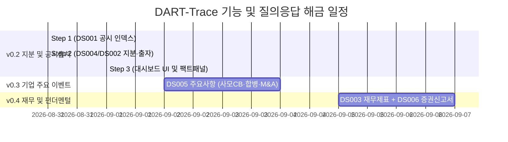

# 📅 [DART-Trace] 프로젝트 진행 현황 및 향후 일정표 (Schedule)

> **기준 일시**: 2026-09-01 11:40 (KST)  
> **현재 마일스톤**: **v0.2 Step 2 완료 / Step 3 UI 연동 진행 대기 / v0.3 설계 초안 검토 중**  
> **책임 엔진**: Antigravity AI Pair Programmer & Data Governance Agent  
> **⚠️ 기준 문서 안내**: 본 프로젝트의 최신 작업 일정 및 거버넌스 기준 문서는 항상 **`내작업폴더/schedule.md`**입니다.  
> **🔒 DB 격리 정책**: 검수 완료된 DART 데이터 상태를 보존하기 위해, 향후 교육/실습용 Cypher 작업과 DART 프로젝트 DB의 물리적 분리(DBMS 분리 또는 포트 분리)를 적용할 예정입니다.

---

## 📊 1. 현재 단계별 진행 현황 및 지표 요약 (Current Status)

| 단계 | 목표 및 작업 내용 | 대상 범위 | 검수 상태 | [스냅샷] 검수 기준 지표 vs 현재 파일럿 재적재 지표 |
|:---:|---|:---:|:---:|---|
| **v0.2 Step 1** | **`DS001` 공시 인덱스 수집 및 DB 승격** | 1차 파일럿 100개사 | **🟢 합격** | • **[검수 스냅샷]** 100개사 파일럿 대상의 전 페이지 공시 `21,538건` 적재 (`[:FILED]` 21,538건) • **[현재 파일럿 DB]** `:DART_Disclosure` `17,443건` / `[:FILED]` `17,443건` • `01_DART_Disclosure_공시인덱스_수집기.py` |
| **v0.2 Step 2** | **`DS004` (지분) + `DS002` (최대주주·타법인출자) 정형 수집·정규화** | 1차 파일럿 100개사 | **🟢 합격 (정식 마감)** | • **[검수 스냅샷]** 지분 `723건` / 출자 `116건` / 후보큐 `3,893건` • **[현재 파일럿 DB]** 지분 `505건` / 출자 `84건` / 후보큐 `3,139건` • `02_DART_P1_지분공시_및_타법인출자_통합파이프라인.py` • `00_DART_Rebuild_파일럿_재적재.py` (재적재 파이프라인) |
| **v0.2 Step 3** | **Streamlit 대시보드 UI 연동 및 팩트 상세 패널 구축** | 프론트엔드 연동 | **🟢 합격 (정식 마감)** | • `app_dart_trace_dashboard.py` (우측 팩트 상세 패널, DART 뷰어 URL 연동, 이중 상태 배지 표기, 4대 서브탭 완비) |
| **v0.3** | **`DS005` 기업 주요 이벤트 (CB·BW발행, 합병, 분할, 주식양수도, 소송)** | 100개사 확장 | **🟡 초안 검토 (Draft)** | • `00_DART_Trace_지식그래프_온톨로지_및_데이터구조_명세서_v0.3.md` • `Company ➔ ANNOUNCED ➔ CapitalEvent ➔ EVIDENCED_BY ➔ Disclosure` 표준 방향 확립 • 회사합병 `cmpMgDecsn` 반영 및 공개매수 분리 |
| **v0.4** | **`DS003` 재무 스냅샷 + `DS006` 증권신고서 상세 결합** | 100개사 확장 | **⚪ 예정** | • 펀더멘털 건전성 진단 및 한도/조건 상세 그래프 |

---

## 🛠️ 2. Step 3 대시보드 UI 연동 핵심 기능 명세

1. **지분 / 타법인 출자 테이블 선택 인터랙션**:
   - 테이블 행(Row) 클릭 또는 셀렉트박스 선택 시 우측 **[팩트 상세 패널 (Fact Detail Panel)]** 즉시 갱신
2. **DART 원문 뷰어 링크 연결**:
   - `viewer_url` (`https://dart.fss.or.kr/dsaf001/main.do?rcpNo=...`) 외부 링크 버튼 연동
3. **이중 상태 배지(Badge) 표시**:
   - 공시 문서 상태: `doc_status` (`🟢 정규 공시 (NORMAL)` / `🟡 기재 정정 (CORRECTED)` / `🔴 철회 (WITHDRAWN)`)
   - 데이터 검증 상태: `verification_status` (`🟢 검증 완료 (VERIFIED)` / `⚪ 후보 큐 보류 (CANDIDATE)`)
4. **날짜 및 최신성 배지 UI 표기**:
   - 결산기준일(`as_of_date`) vs 공시접수일(`reported_on`) 분리 표시
   - 최신 유효 여부(`is_current`: `🟢 최신 유효 사실` / `⚪ 과거 이력`)

---

## 🚀 3. v0.3 확장 아키텍처 및 핵심 온톨로지 (Draft)

* **온톨로지 명세서**: [`내작업폴더/00_DART_Trace_지식그래프_온톨로지_및_데이터구조_명세서_v0.3.md`](file:///c:/Users/Playdata/enkoa-practice-knowledge-graph/enkoa-practice-knowledge-graph/%EB%82%B4%EC%9E%91%EC%97%85%ED%8F%B4%EB%8D%94/00_DART_Trace_%EC%A7%80%EC%8B%9D%EA%B7%B8%EB%9E%98%ED%94%84_%EC%98%A8%ED%86%A8%EB%A1%9C%EC%A7%80_%EB%B0%8F_%EB%8D%B0%EC%9D%B4%ED%84%B0%EA%B5%AC%EC%A1%B0_%EB%AA%85%EC%84%B8%EC%84%9C_v0.3.md)
* **표준 관계 방향**:
  * `(Company) ──[:ANNOUNCED]──> (CapitalEvent) ──[:EVIDENCED_BY]──> (Disclosure)`
  * `(Investor) ──[:SUBSCRIBED]──> (CapitalEvent)`
  * `(CompanyA) ──[:MERGED_WITH / :ACQUIRED_STAKE / :SPUN_OFF_FROM]──> (CompanyB)`
* **범위 정정**: OpenDART DS005 공식 미지원인 공개매수(`TENDER_OFFER`)는 제외(추후 검토).
* **표현 정정**: 사실 기반 공시 연계 분석으로 명확화 (인과관계 단정 표현 배제).

---

## 📈 4. 버전별 해금 질문(Q/A) 로드맵

