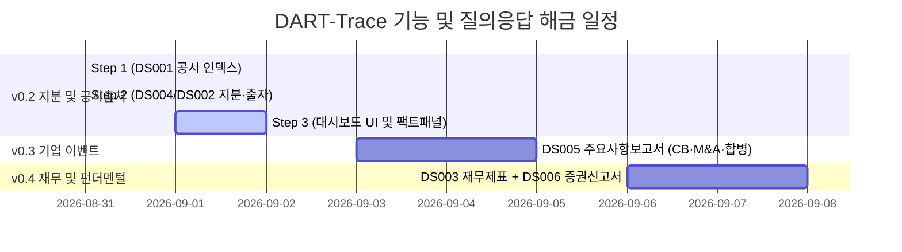

# 📅 [DART-Trace] 프로젝트 진행 현황 및 향후 일정표 (Schedule)

> **기준 일시**: 2026-08-31 17:46 (KST)  
> **현재 마일스톤**: **v0.2 Step 2 (데이터 정규화 및 적재) 공식 완료 / Step 3 대기**  
> **책임 엔진**: Antigravity AI Pair Programmer & Data Governance Agent

---

## 📊 1. 현재 단계별 진행 현황 요약 (Current Status)

| 단계 | 목표 및 작업 내용 | 대상 범위 | 검수 상태 | 산출물 / 핵심 DB 지표 |
|:---:|---|:---:|:---:|---|
| **v0.2 Step 1** | **`DS001` 공시 인덱스 수집 및 DB 승격** | 1차 파일럿 100개사 | **🟢 합격** | • `:DART_Disclosure` 노드: `21,538개` • `[:FILED]` 관계: `21,538건` • `01_DART_Disclosure_공시인덱스_수집기.py` |
| **v0.2 Step 2** | **`DS004` (지분) + `DS002` (최대주주·타법인출자) 정형 수집·정규화** | 1차 파일럿 100개사 | **🟢 합격 (정식 마감)** | • `:OWNS_STAKE` 관계: `723건` (기존 베이스라인 `319건` + 신규 `404건`) • `:INVESTED_IN` 관계: `116건` (유효 지분율 108건, 유효 장부가액 106건) • 미식별/미매칭 영구 후보 큐: `3,893건` (`candidate_queue.jsonl`) • `02_DART_P1_지분공시_및_타법인출자_통합파이프라인.py` |
| **v0.2 Step 3** | **Streamlit 대시보드 UI 연동 및 팩트 패널 구축** | 프론트엔드 연동 | **⏳ 다음 예정** | • `app_dart_trace_dashboard.py` (우측 팩트 상세 패널, DART 뷰어 URL 연동) |
| **v0.3** | **`DS005` 기업 주요 이벤트 (CB발행, 합병, 분할, 주식양수도)** | 100개사 확장 | **⚪ 예정** | • `:INVESTED_CB`, `:MERGED_WITH`, `:ACQUIRED` 관계 승격 |
| **v0.4** | **`DS003` 재무 스냅샷 + `DS006` 증권신고서 상세 결합** | 100개사 확장 | **⚪ 예정** | • 펀더멘털 건전성 진단 및 한도/조건 상세 그래프 |

---

## 🛠️ 2. Step 2 데이터 품질 및 거버넌스 확정 사항

1. **타법인출자 OpenDART 공식 규격 100% 반영**:
   * 기말 지분율: `trmend_blce_qota_rt` (%)
   * 기말 장부가액: `trmend_blce_acntbk_amount` (원)
   * 기말 주식수: `trmend_blce_qy`
   * 출자 목적: `invstmnt_purps`
   * 결산 기준일: `stlm_dt` ➔ `as_of_date` (`YYYY-MM-DD`)
2. **날짜 속성 분리**:
   * 대량보유(5%룰): `rcept_dt` ➔ **`reported_on`** (공시 접수일)
   * 정기보고서(최대주주/타법인출자): `stlm_dt` ➔ **`as_of_date`** (결산 기준일)
3. **개체 식별(Entity Resolution) 및 후보 큐(Candidate Queue)**:
   * 검색 결과 정확히 1개사(`len(matches) == 1`) 매칭 법인 및 검증 대형 기관만 `VERIFIED` 관계 생성.
   * 단순 개인명 및 미검증 비상장 법인 **`3,893건`은 `candidate_queue.jsonl`에 영구 보관** (동명이인/임의 연결 원천 차단).
4. **최신성 동적 산출**:
   * `(owner, target)` 쌍별 최신 일자에만 `is_current = true` 부여, 과거 공시는 `is_current = false`로 이력 보존.
5. **기존 베이스라인 관계 완벽 보존**:
   * 기존 319건의 베이스라인 지분 관계 100% 유지.

---

## 🚀 3. 다음 할 일 (Next To-Do Action Items)

### 📌 [Step 3] Streamlit 대시보드 UI 연동 및 팩트 상세 패널 강화
* **대상 파일**: [`내작업폴더/app_dart_trace_dashboard.py`](file:///c:/Users/Playdata/enkoa-practice-knowledge-graph/enkoa-practice-knowledge-graph/%EB%82%B4%EC%9E%91%EC%97%85%ED%8F%B4%EB%8D%94/app_dart_trace_dashboard.py)
* **주요 개발 내용**:
  1. **지분 / 타법인 출자 테이블 선택 인터랙션**:
     - 테이블 행 클릭/선택 시 우측 **[팩트 상세 패널 (Fact Detail Panel)]** 즉시 갱신
  2. **DART 원문 뷰어 링크 연결**:
     - `viewer_url` (`https://dart.fss.or.kr/dsaf001/main.do?rcpNo=...`) 외부 링크 버튼 연동
  3. **이중 상태 배지(Badge) 표시**:
     - 공시 문서 상태: `doc_status` (`NORMAL` 정정·철회로 분류되지 않은 공시 / `CORRECTED` / `WITHDRAWN`)
     - 데이터 검증 상태: `verification_status` (`VERIFIED` / `CANDIDATE`)
  4. **날짜 및 최신성 배지 UI 표기**:
     - 결산기준일(`as_of_date`) vs 공시접수일(`reported_on`) 분리 표시
     - 최신 유효 여부(`is_current`: `🟢 최신` / `⚪ 과거이력`)

---

## 📈 4. 버전별 해금 질문(Q/A) 로드맵

